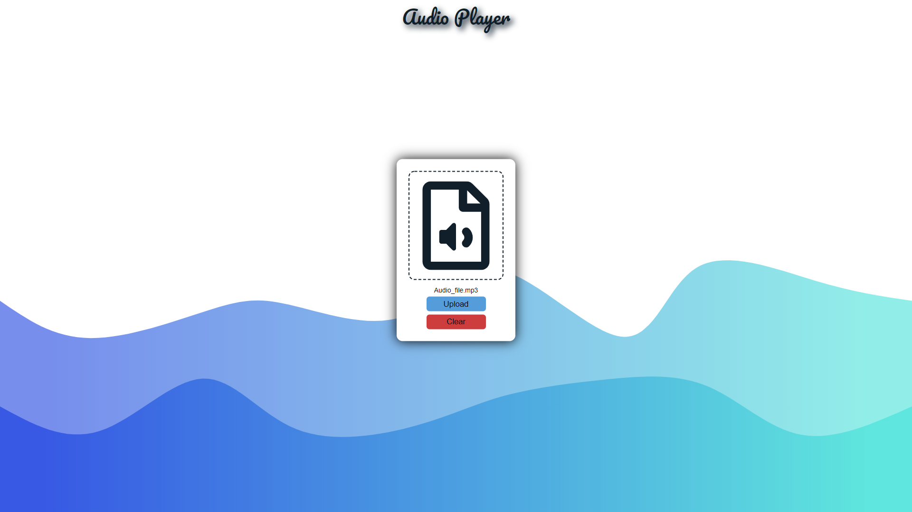
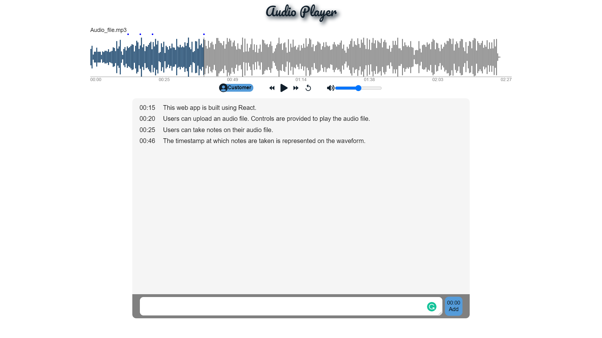

:link: https://audio-player-with-notes.netlify.app/ \
React project to upload audio file, play them and take notes.\
packages used - wavesurfer.js, react-icons etc.

## Available Scripts

In the project directory, you can run:

### `npm start`

Runs the app in the development mode.\
Open [http://localhost:3000](http://localhost:3000) to view it in the browser.

The page will reload if you make edits.\
You will also see any lint errors in the console.

### `npm run build`

Builds the app for production to the `build` folder.\
It correctly bundles React in production mode and optimizes the build for the best performance.

The build is minified and the filenames include the hashes.\
Your app is ready to be deployed!\

### Audio Player

- User can upload audio file of any extention.
- This web app provides necessary features of media player.
- Wavesurfer is used to generate waveform of audio file.
- Notes can be taken at any timestamp, that will reflect on waveform too.

    
    

